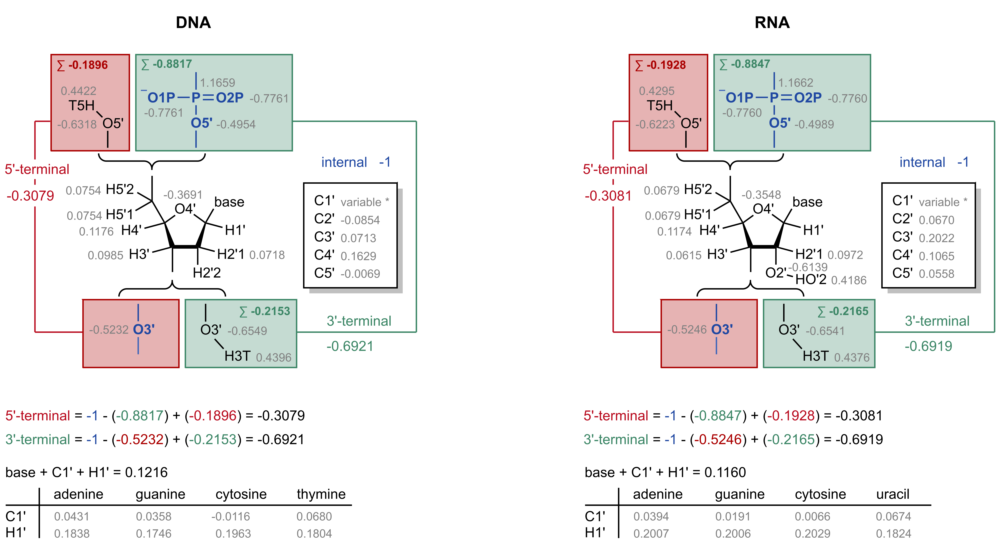
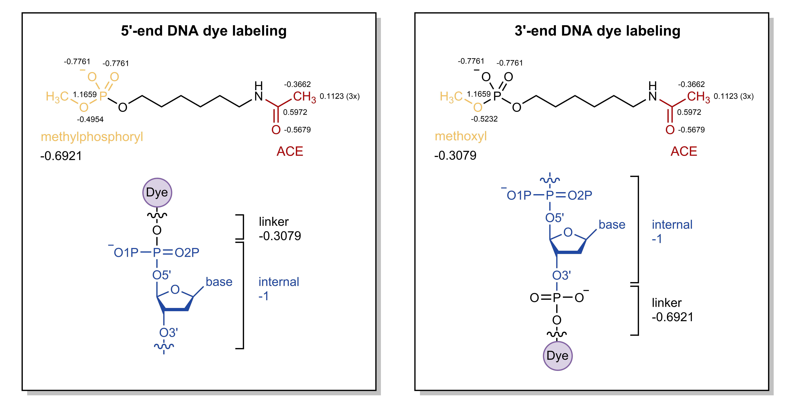
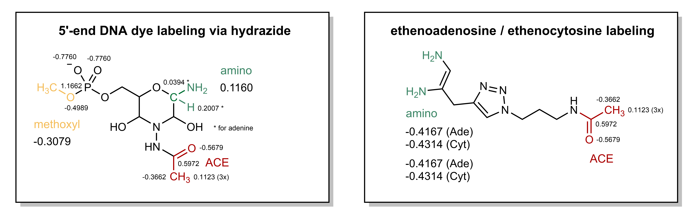

---
jupyter:
  jupytext:
    formats: ipynb,md
    text_representation:
      extension: .md
      format_name: markdown
      format_version: '1.3'
      jupytext_version: 1.11.5
  kernelspec:
    display_name: Python 3 (ipykernel)
    language: python
    name: python3
---

# Deriving FRETlabel fragments

This notebook describes the derivation of all base-linker fragments currently available in *FRETlabel* (A step-wise tutorial for dT-C5-Cy3 is available [here](../getting_started/fragment_building.md)). Before starting make sure that the **mol2** files of the nucleotides have the correct partial charges assigned. See [this](partial_charges_to_mol2.md) notebook for instructions.

```{admonition} Pre-generated parameters in *FRETlabel* on Github
- RNA and DNA nucleotides with correct partial charges are located in `fragments/1_bases/processed/`
- Linkers for [selected labeling chemistries](../background/labeling_chemistry.md) are located in `fragments/2_linkers`
- Dyes from AMBER-DYES are located in `fragments/3_dyes/` (in Tripos mol2 format)
- base_linker generated herein are located in `fragments/4_base_linker/`
- Generated acpype output files are located in `fragments/5_acpype/`
- force field parameters from AMBER-DYES are located in `forcefields/2_amberdyes`
- bonded and nonbonded parameters from AMBER-14 are located in `forcefields/3_amber14sb`
- generated force field parameters for fretlabel are located in `forcefields/4_fretlabel`
```

```python
import pandas as pd
from biopandas.mol2 import PandasMol2
import pathlib
import fretlabel as fl
```

```python
cd ../../
```

<!-- #region -->
## 1. Internal labeling fragments
### 1.1 Internal Labeling on C5 of deoxythymidine

#### 1.1.1 Geometry optimization

Create Gaussian input file
```sh
name=MLE_capped
input_folder='in/'
output_folder='out/'

cd fragments/2_linkers/MLE/
antechamber -i "$input_folder/$name".mol2 -fi mol2 -o "$output_folder/$name".gin -fo gcrt -gv 1 -ge "$output_folder/$name".gesp -ch "$output_folder/$name"_opt -nc 0
```

Gaussian geometry optimization and ESP calculation
```sh
nproc=12
sed 's/#HF.*/\#P b3lyp\/6-31G\* Opt/g' < "$output_folder/$name".gin | sed '/iop/d' | sed '/.*gesp/d' | sed "/--Link1--/ a %nproc=$nproc" > "$output_folder/$name"_b3lyp_opt.gin
sed '/^[[:space:]]*[A-Z]/d' < "$output_folder/$name".gin | sed 's/SCF/Geom=check SCF/g'| sed 's/\(\%chk=.*\)opt/\1esp/g' | sed "/--Link1--/ a %nproc=$nproc" > "$output_folder/$name"_hf_esp.gin
g09 < "$output_folder/$name"_b3lyp_opt.gin > "$output_folder/$name"_b3lyp_opt.gout && cp "$output_folder/$name"_opt.chk "$output_folder/$name"_esp.chk
g09 < "$output_folder/$name"_hf_esp.gin > "$output_folder/$name"_hf_esp.gout
```

#### 1.1.2 Partial charge fitting with RESP

```sh
antechamber -i "$input_folder/$name".mol2 -fi mol2 -o "$output_folder/$name".ac -fo ac -pf yes -nc 0

capping_group=MLE_capping_groups.dat

n_atom=`awk '$1 == "GROUP" {print $2}' "$input_folder/$capping_group"`
group_constraint=`awk '$1 == "GROUP" {print $3}' "$input_folder/$capping_group"`

respgen -i "$output_folder/$name".ac -o "$output_folder/$name".respin1 -f resp1 -a "$input_folder/$capping_group"
respgen -i "$output_folder/$name".ac -o "$output_folder/$name".respin2 -f resp2 -a "$input_folder/$capping_group"
```

since respgen rounds the group constraint to three decimals replace it with the value from the capping group
```sh
for i in `seq $(echo $n_atom | wc -w)`;do
    atom=`echo $n_atom | cut -f$i -d' '`
    group=`echo $group_constraint | cut -f$i -d' '`
    sed -z -i "s/$atom\s*-*\w\.\w*$p/$atom  $group/$i" "$output_folder/$name".respin1
    sed -z -i "s/$atom\s*-*\w\.\w*$p/$atom  $group/$i" "$output_folder/$name".respin2
done

espgen -i "$output_folder/$name"_hf_esp.gout -o "$output_folder/$name"_hf_esp.esp
mv QIN "$output_folder"/

resp -O -i "$output_folder/$name".respin1 -o "$output_folder/$name".respout1 -e "$output_folder/$name"_hf_esp.esp -q  "$output_folder"/QIN -t "$output_folder"/qout_stage1 -p "$output_folder"/punch1 -s "$output_folder"/esout1
resp -O -i "$output_folder/$name".respin2 -o "$output_folder/$name".respout2 -e "$output_folder/$name"_hf_esp.esp -q "$output_folder"/qout_stage1 -t "$output_folder"/qout_stage2 -p "$output_folder"/punch2 -s "$output_folder"/esout2

antechamber -i "$output_folder/$name".ac -fi ac -o "$output_folder/$name"_resp.mol2 -fo mol2 -c rc -cf "$output_folder"/qout_stage2 -pf yes -at amber
```

````{tip}
The above two-stage RESP fitting protocol is wrapped in the following script:

```
resp_fit.sh -n MLE_capped -i 'in/' -o 'out/' -g MLE_capping_groups.dat -c 0
```
````


#### 1.1.3 Coupling to base and dye
Open PyMOL and couple the deoxythymine base and the MLE linker by executing the following from the PymOL command prompt

```python
names_methylene = ['C7','H01','H02']

base_resn = ('deoxythymidine', 'DTM')
#base_resn = ('oxythymidine', 'RUM')

cmd.reinitialize()
cmd.load('fragments/1_bases/out/{}.mol2'.format(base_resn[0]))
cmd.load('fragments/2_linkers/MLE/out/MLE_capped_resp.mol2')
cmd.remove('MLE_capped_resp and name {}'.format('+'.join(str(i) for i in names_methylene)))
cmd.remove('{} and (name H71 or name H72)'.format(base_resn[0]))
cmd.fuse('{} and name C7'.format(base_resn[0]), 'MLE_capped_resp and name C8 and resn MLE')
cmd.delete('{}'.format(base_resn[0]))
cmd.alter('all', 'type="ATOM"')
cmd.alter('all', 'elem=""') # PyMOL struggles with atom type definitions in mol2 files, therefore let PyMOL guess the elements itself
cmd.set_name('MLE_capped_resp', base_resn[1])
cmd.set_title(base_resn[1],1,base_resn[1])
cmd.unbond('resn {} and name C8'.format(base_resn[1]), 'resn DT and name C7')
cmd.bond('resn {} and name C8'.format(base_resn[1]), 'resn DT and name C7', 2)

import fretlabel as fl
fl.ff.pymol_savemol2(f'fragments/4_base_linkers/{base_resn[1]}.mol2', base_resn[1], overwrite=True)
```
<!-- #endregion -->

Check the correct charge
```python
base_resn = ('deoxythymidine', 'DTM')
#base_resn = ('oxythymidine', 'RUM')
fl.ff.check_charge(f'fragments/4_base_linkers/{base_resn[1]}.mol2', -1)
```

Now, add the fluorophore in PyMOL

<!-- #region -->
```python
# execute a multiline statement in the PyMOL command shell
python  
dyes = [('sCy3', 'C3W'), ('sCy5', 'C5W'), ('Cy7', 'C7N'), ('Cy5.5', 'C55'), ('Cy7.5','C75'), 
        ('Alexa350', 'A35'), ('Alexa488', 'A48'), ('Alexa532', 'A53'), ('Alexa568', 'A56'), 
        ('Alexa594', 'A59'), ('Alexa647', 'A64'), ('Atto390', 'T39'), ('Atto425', 'T42'), 
        ('Atto465', 'T46'), ('Atto488', 'T48'), ('Atto495', 'T49'), ('Atto514', 'T51'), 
        ('Atto520', 'T52'), ('Atto610', 'T61')]

base_resn_list = [('deoxythymidine', 'DTM'),('oxythymidine', 'RUM')]
for base_resn in base_resn_list:
    for name,dye in dyes:
        fl.ff.pymol_couple_dye2baselinker(f'fragments/3_dyes/{dye}.mol2', 
                                          f'fragments/4_base_linkers/{base_resn[1]}.mol2', 
                                          'C99', ['C17', 'O98', 'C16'],
                                          ['O98', 'C16', 'C17', 'H95', 'H96', 'H97'])
        cmd.alter('all', 'elem=""')
        fl.ff.pymol_save_molecule('src/fretlabel/dyes/{}_{}.pdb'.format(dye, base_resn[1]), 
                                  '{}_{}'.format(dye, base_resn[1]), 'pdb', overwrite=True)
        fl.ff.update_dye_library({'filename':'{}_{}'.format(dye, base_resn[1]), 'dye':name, 
                                  'base':base_resn[1][0:2], 'linker':'MLE', 'chemistry':'U/dT-C5',
                                  'position':'internal'}, 
                                  'src/fretlabel/dye_library.json',
                                  'src/fretlabel/dye_library.json', 
                                  overwrite=True)
python end
```
<!-- #endregion -->

<!-- #region -->
### 1.2 Internal labeling via ethenoadenine or ethenocytosine

#### 1.2.1 Geometry optimization

Same as for deoxythymine (MLE) but with `name=ETH_capped`

#### 1.2.2 Partial charge fitting with RESP

```{admonition} Rational for linker RESP charge derivation at internal ethenoadenine / ethenocytosine
The amino capping groups of the linker (which will be removed) are constrained to the partial charge of H61+H62 (adenosine/deoxyadenosine) or H41+H42 (cytidine/deoxycytidine) (e.g. for deoxyadenosine 2\*(-0.4167)= **-0.8334**). Thus for deoxyadenosine the linker will be 0-(-0.8334)=**0.8334** which compensates the missing H61/N62 or H41/N42 in the ethenoadenosine / ethenocytidine.
```

In general the same as for deoxythymine (MLE). For RESP use:

```sh
resp_fit.sh -n ETH_capped -i 'in/' -o 'out/' -g ETH_capping_groups_adenine_DNA.dat -c 0
resp_fit.sh -n ETH_capped -i 'in/' -o 'out/' -g ETH_capping_groups_cytosine_DNA.dat -c 0
resp_fit.sh -n ETH_capped -i 'in/' -o 'out/' -g ETH_capping_groups_adenine_RNA.dat -c 0
resp_fit.sh -n ETH_capped -i 'in/' -o 'out/' -g ETH_capping_groups_cytosine_RNA.dat -c 0
```
<!-- #endregion -->

<!-- #region -->
#### 1.2.3 Coupling to base and dye
Open PyMOL and executing the following from the PymOL command prompt

```python
names_amine = ['N1','N6','H11','H12','H61','H62']

base_resn = ('deoxyadenosine', 'DAE')
#base_resn = ('deoxycytidine', 'DCE')
#base_resn = ('adenosine', 'RAE')
#base_resn = ('cytidine', 'RCE')

cmd.reinitialize()
cmd.load('fragments/1_bases/out/{}.mol2'.format(base_resn[0]))

if 'A' in base_resn[1]:
    cmd.load('fragments/2_linkers/ETH/out/ETH_capped_resp_{}.mol2'.format(base_resn[0]))
    cmd.pair_fit('ETH_capped_resp and name N1','{} and name N1'.format(base_resn[0]), 
                 'ETH_capped_resp and name N6', '{} and name N6'.format(base_resn[0]),
                 'ETH_capped_resp and name H11', '{} and name C2'.format(base_resn[0]))
else:
    cmd.load('fragments/2_linkers/ETH/out/ETH_capped_resp_{}.mol2'.format(base_resn[0]))
    cmd.pair_fit('ETH_capped_resp and name N1','{} and name N3'.format(base_resn[0]), 
                 'ETH_capped_resp and name N6', '{} and name N4'.format(base_resn[0]),
                 'ETH_capped_resp and name H11', '{} and name C2'.format(base_resn[0]))
    
cmd.remove('ETH_capped_resp and name {}'.format('+'.join(str(i) for i in names_amine)))
if 'A' in base_resn[1]:
    cmd.remove('{} and (name H61 or name H62)'.format(base_resn[0]))
    cmd.remove('{} and name H61'.format(base_resn[0]))
    cmd.unbond('{} and name C6'.format(base_resn[0]), '{} and name N6'.format(base_resn[0]))
    cmd.bond('{} and name C6'.format(base_resn[0]), '{} and name N6'.format(base_resn[0]), 2)
    cmd.unbond('{} and name C6'.format(base_resn[0]), '{} and name N1'.format(base_resn[0]))
    cmd.bond('{} and name C6'.format(base_resn[0]), '{} and name N1'.format(base_resn[0]), 1)
else:
    cmd.remove('{} and (name H41 or name H42)'.format(base_resn[0]))
    cmd.unbond('{} and name C4'.format(base_resn[0]), '{} and name N4'.format(base_resn[0]))
    cmd.bond('{} and name C4'.format(base_resn[0]), '{} and name N4'.format(base_resn[0]), 2)
    cmd.unbond('{} and name C4'.format(base_resn[0]), '{} and name N3'.format(base_resn[0]))
    cmd.bond('{} and name C4'.format(base_resn[0]), '{} and name N3'.format(base_resn[0]), 1)
    
cmd.create(base_resn[1], 'ETH_capped or {}'.format(base_resn[0]))
cmd.delete(base_resn[0])
cmd.delete('ETH_capped')

if 'A' in base_resn[1]:
    cmd.bond('{} and name N1'.format(base_resn[1]), '{} and name C9'.format(base_resn[1]))
    cmd.bond('{} and name N6'.format(base_resn[1]), '{} and name C7'.format(base_resn[1]))
else:
    cmd.bond('{} and name N3'.format(base_resn[1]), '{} and name C9'.format(base_resn[1]))
    cmd.bond('{} and name N4'.format(base_resn[1]), '{} and name C7'.format(base_resn[1]))
    
cmd.alter('all', 'type="ATOM"')
cmd.alter('all', 'elem=""')
cmd.set_title(base_resn[1],1,base_resn[1])

fl.ff.pymol_savemol2('fragments/4_base_linkers/{}.mol2'.format(base_resn[1]), base_resn[1], overwrite=True)
```
<!-- #endregion -->

Check the correct charge
```python
fl.ff.check_charge('fragments/4_base_linkers/{}.mol2'.format(base_resn[1]), -1)
```

Now, add the fluorophore in PyMOL

<!-- #region -->
```python
base_resn_list = [('deoxyadenosine', 'DAE'), ('deoxycytidine', 'DCE'), ('adenosine', 'RAE'), ('cytidine', 'RCE')]

for base_resn in base_resn_list:

    for name, dye in dyes:
        fl.ff.pymol_couple_dye2baselinker(dye, base_resn[1], 'C99', ['C17', 'O98', 'C16'], ['O98', 'C16', 'C17', 'H95', 'H96', 'H97'])
        cmd.alter('all', 'elem=""')
        fl.ff.pymol_save_molecule('fluorlabel/dyes/{}_{}.pdb'.format(dye, base_resn[1]), '{}_{}'.format(dye, base_resn[1]), 'pdb', overwrite=True)
        for base in ['RA', 'RC', 'DA', 'DC']:    
            fl.ff.update_dye_library({'filename':'{}_{}E'.format(dye, base), 'dye':name, 'base':base, 'linker':'ETH', 'chemistry':'etheno', 'position':'internal'}, 'fluorlabel/dye_library.json', 'fluorlabel/dye_library.json', overwrite=True)
```
<!-- #endregion -->

<!-- #region -->
## 2. End labeling fragments
### 2.1 Labeling via phosphate at 5'-end

#### 2.1.1 Geometry optimization

Create Gaussian input file
```sh
name=POS_capped
input_folder='in/'
output_folder='out/'
```

Here, the net charge is -1
```sh
cd fragments/2_linkers/POS/
antechamber -i "$input_folder/$name".mol2 -fi mol2 -o "$output_folder/$name".gin -fo gcrt -gv 1 -ge "$output_folder/$name".gesp -ch "$output_folder/$name"_opt -nc -1
```

Gaussian geometry optimization and ESP calculation
```sh
nproc=12
sed 's/#HF.*/\#P b3lyp\/6-31G\* Opt/g' < "$output_folder/$name".gin | sed '/iop/d' | sed '/.*gesp/d' | sed "/--Link1--/ a %nproc=$nproc" > "$output_folder/$name"_b3lyp_opt.gin
sed '/^[[:space:]]*[A-Z]/d' < "$output_folder/$name".gin | sed 's/SCF/Geom=check SCF/g'| sed 's/\(\%chk=.*\)opt/\1esp/g' | sed "/--Link1--/ a %nproc=$nproc" > "$output_folder/$name"_hf_esp.gin
g09 < "$output_folder/$name"_b3lyp_opt.gin > "$output_folder/$name"_b3lyp_opt.gout && cp "$output_folder/$name"_opt.chk "$output_folder/$name"_esp.chk
g09 < "$output_folder/$name"_hf_esp.gin > "$output_folder/$name"_hf_esp.gout
```

#### 2.1.2 Partial charge fitting with RESP

```{admonition} Rational for linker RESP charge derivation at 3'/5'-ends via phosphate
*Reference*: [AMBER-MD tutorial](https://ambermd.org/tutorials/advanced/tutorial1/section1.htm)

In the AMBER force fields (Cornell, *JACS*, **1995**) the **DNA** nucleotides the charges at the termini is as follows:
- 5'-end nucleotide: -0.3079
- 3'-end nucleotide: -0.6921

For **RNA** the charges are:
- 5'-end nucleotide: -0.3081
- 3'-end nucleotide: -0.6919



---

**Labeled DNA 5'-terminus**:

The 5'-end nucleotide will become an internal residue (DNA charge: -1; i.e. the phosphate of the linker will be transferred to this nucleotide). The linker will become the new 5'-terminus (DNA charge: -0.3079). For this purpose, the **methylphosphate cap** ($-PO_2-OCH_3$) of the linker (which will be removed) should be constrained to a charge of -1-(-0.3079)=**-0.6921** during the RESP fit.

**Labeled DNA 3'-terminus**:

The 3'-end nucleotide will become an internal residue (DNA charge: -1). The linker will become the new 3'-terminus (DNA charge: -0.36921, i.e. $-PO_2-$ will be retained). For this purpose, the **methoxy cap** ($-O-CH_3$) of the linker (which will be removed) should be constrained to a charge of -1-(-0.6021)=**-0.3079** during the RESP fit.


```

Run Antechamber with net charge -1
```sh
antechamber -i "$input_folder/$name".mol2 -fi mol2 -o "$output_folder/$name".ac -fo ac -pf yes -nc -1

capping_group=POS_capping_groups_5prime_DNA.dat

n_atom=`awk '$1 == "GROUP" {print $2}' "$input_folder/$capping_group"`
group_constraint=`awk '$1 == "GROUP" {print $3}' "$input_folder/$capping_group"`

respgen -i "$output_folder/$name".ac -o "$output_folder/$name".respin1 -f resp1 -a "$input_folder/$capping_group"
respgen -i "$output_folder/$name".ac -o "$output_folder/$name".respin2 -f resp2 -a "$input_folder/$capping_group"

# since respgen rounds the group constraint to three decimals replace it with the value from the capping group
for i in `seq $(echo $n_atom | wc -w)`;do
    atom=`echo $n_atom | cut -f$i -d' '`
    group=`echo $group_constraint | cut -f$i -d' '`
    sed -z -i "s/$atom\s*-*\w\.\w*$p/$atom  $group/$i" "$output_folder/$name".respin1
    sed -z -i "s/$atom\s*-*\w\.\w*$p/$atom  $group/$i" "$output_folder/$name".respin2
done

espgen -i "$output_folder/$name"_hf_esp.gout -o "$output_folder/$name"_hf_esp.esp
mv QIN "$output_folder"/

resp -O -i "$output_folder/$name".respin1 -o "$output_folder/$name".respout1 -e "$output_folder/$name"_hf_esp.esp -q  "$output_folder"/QIN -t "$output_folder"/qout_stage1 -p "$output_folder"/punch1 -s "$output_folder"/esout1
resp -O -i "$output_folder/$name".respin2 -o "$output_folder/$name".respout2 -e "$output_folder/$name"_hf_esp.esp -q "$output_folder"/qout_stage1 -t "$output_folder"/qout_stage2 -p "$output_folder"/punch2 -s "$output_folder"/esout2

antechamber -i "$output_folder/$name".ac -fi ac -o "$output_folder/$name"_resp.mol2 -fo mol2 -c rc -cf "$output_folder"/qout_stage2 -pf yes -at amber
```

````{tip}
The above two-stage RESP fitting protocol is wrapped in the following script:

```
resp_fit.sh -n POS_capped -i 'in/' -o 'out/' -g POS_capping_groups_5prime_DNA.dat -c -1
```
````

#### 2.1.3 Coupling of base and dye
Again, open PyMOL and couple the deoxythymine base and the MLE linker by executing the following from the PymOL command prompt

```python
names_methyl = ['C01','H01','H02','H03']
names_phosphate = ['P','O1P','O5\'','O2P']


base_resn = ('deoxythymidine', 'DTP')
# base_resn = ('deoxyadenosine', 'DAP')
# base_resn = ('deoxyguanosine', 'DGP')
# base_resn = ('deoxycytidine', 'DCP')
# base_resn = ('uridine', 'RUP')
# base_resn = ('adenosine', 'RAP')
# base_resn = ('guanosine', 'RGP')
# base_resn = ('cytidine', 'RCP')

cmd.reinitialize()
cmd.load('fragments/1_bases/out/{}.mol2'.format(base_resn[0]))

if 'D' in base_resn[1]:
    POS_capped_resp = 'POS_capped_resp_5prime_DNA'
else:
    POS_capped_resp = 'POS_capped_resp_5prime_RNA'
    
cmd.load('fragments/2_linkers/POS/out/{}.mol2'.format(POS_capped_resp))
cmd.align('{} and name {}'.format(POS_capped_resp, '+'.join(str(i) for i in names_phosphate)), '{} and (name P or name O1P or name O2P or name O5\')'.format(base_resn[0]))
cmd.remove('{} and name {}'.format(POS_capped_resp, '+'.join(str(i) for i in names_methyl+names_phosphate)))
cmd.create(base_resn[1], '{} or {}'.format(POS_capped_resp, base_resn[0]))
cmd.delete(base_resn[0])
cmd.delete(POS_capped_resp)
cmd.bond('{} and name P'.format(base_resn[1]), '{} and name O01'.format(base_resn[1]))
cmd.alter('all', 'type="ATOM"')
cmd.alter('all', 'elem=""')
cmd.set_title(base_resn[1],1,base_resn[1])

import fretlabel as fl
fl.ff.pymol_savemol2('fragments/4_base_linkers/{}.mol2'.format(base_resn[1]), base_resn[1], overwrite=True)
```
<!-- #endregion -->

Check the correct charge
```python
base_resn = ('deoxythymidine', 'DTP')
# base_resn = ('deoxyadenosine', 'DAP')
# base_resn = ('deoxyguanosine', 'DGP')
# base_resn = ('deoxycytidine', 'DCP')
# base_resn = ('uridine', 'RUP')
# base_resn = ('adenosine', 'RAP')
# base_resn = ('guanosine', 'RGP')
# base_resn = ('cytidine', 'RCP')

if 'D' in base_resn[1]:
    fl.ff.check_charge('fragments/4_base_linkers/{}.mol2'.format(base_resn[1]), -1.3079)
else:
    fl.ff.check_charge('fragments/4_base_linkers/{}.mol2'.format(base_resn[1]), -1.3081)
```

<!-- #region -->
Then add the fluorophore
```python
# execute a multiline statement in the PyMOL command shell
python
base_resn_list = [('deoxythymidine', 'DTP'), 
                  ('deoxyadenosine', 'DAP'),
                  ('deoxyguanosine', 'DGP'),
                  ('deoxycytidine', 'DCP'),
                  ('uridine', 'RUP'),
                  ('adenosine', 'RAP'),
                  ('guanosine', 'RGP'),
                  ('cytidine', 'RCP')]

for base_resn in base_resn_list:

    for name, dye in dyes:
        fl.ff.pymol_couple_dye2baselinker(dye, base_resn[1], 'C99', ['C17', 'O98', 'C16'], ['O98', 'C16', 'C17', 'H95', 'H96', 'H97'])
        cmd.alter('all', 'elem=""')
        fl.ff.pymol_save_molecule('fluorlabel/dyes/{}_{}.pdb'.format(dye, base_resn[1]), '{}_{}'.format(dye, base_resn[1]), 'pdb', overwrite=True)
        for base in ['RA', 'RG', 'RC', 'RU', 'DA', 'DG', 'DC', 'DT']:
            fl.ff.update_dye_library({'filename':'{}_{}P'.format(dye, base), 'dye':name, 'base':base, 'linker':'POS', 'chemistry':'phosphate', 'position':"5'-end"}, 'fluorlabel/dye_library.json', 'fluorlabel/dye_library.json', overwrite=True)
python end
```
<!-- #endregion -->

<!-- #region -->
### 2.2 Labeling via phosphate at 3'-end

#### 2.1.1 Geometry optimization
Same as for 5'-end.

#### 2.1.2 Partial charge fitting with RESP
Same as for 5'-end. For RESP use instead:
```sh
resp_fit.sh -n POS_capped -i 'in/' -o 'out/' -g POS_capping_groups_3prime_DNA.dat -c -1
resp_fit.sh -n POS_capped -i 'in/' -o 'out/' -g POS_capping_groups_3prime_RNA.dat -c -1
```

#### 2.1.3 Coupling of base and dye
First couple the bases and the POS linker, then add the dye.

```python
names_methyl = ['C01','H01','H02','H03']

base_resn = ('deoxythymidine', 'DTO')
# base_resn = ('deoxyadenosine', 'DAO')
# base_resn = ('deoxyguanosine', 'DGO')
# base_resn = ('deoxycytidine', 'DCO')
# base_resn = ('uridine', 'RUO')
# base_resn = ('adenosine', 'RAO')
# base_resn = ('guanosine', 'RGO')
# base_resn = ('cytidine', 'RCO')

cmd.reinitialize()
cmd.load('fragments/1_bases/out/{}.mol2'.format(base_resn[0]))

if 'D' in base_resn[1]:
    POS_capped_resp = 'POS_capped_resp_3prime_DNA'
else:
    POS_capped_resp = 'POS_capped_resp_3prime_RNA'
    
cmd.load('fragments/2_linkers/POS/out/{}.mol2'.format(POS_capped_resp))
cmd.alter('{} and name P'.format(POS_capped_resp),'name="P1"')
cmd.alter('{} and name O1P'.format(POS_capped_resp),'name="O3P"')
cmd.alter('{} and name O2P'.format(POS_capped_resp),'name="O4P"')
cmd.pair_fit('{} and name O5\''.format(POS_capped_resp),'{} and name O3\''.format(base_resn[0]), 
                 '{} and name C01'.format(POS_capped_resp), '{} and name C3\''.format(base_resn[0]), 
                 '{} and name H03'.format(POS_capped_resp), '{} and name H3\''.format(base_resn[0]))
cmd.remove('{} and (name {} or name O5\')'.format(POS_capped_resp, '+'.join(str(i) for i in names_methyl)))
cmd.create(base_resn[1], '{} or {}'.format(POS_capped_resp, base_resn[0]))
cmd.delete(base_resn[0])
cmd.delete(POS_capped_resp)
cmd.bond('{} and name P1 and resn POS'.format(base_resn[1]), '{} and name O3\''.format(base_resn[1]))
cmd.alter('all', 'type="ATOM"')
cmd.alter('all', 'elem=""')
cmd.set_title(base_resn[1],1,base_resn[1])

import fretlabel as fl
fl.ff.pymol_savemol2('fragments/4_base_linkers/{}.mol2'.format(base_resn[1]), base_resn[1], overwrite=True)
```
<!-- #endregion -->

Check the correct charge
```python
base_resn = ('deoxythymidine', 'DTO')
# base_resn = ('deoxyadenosine', 'DAO')
# base_resn = ('deoxyguanosine', 'DGO')
# base_resn = ('deoxycytidine', 'DCO')
# base_resn = ('uridine', 'RUO')
# base_resn = ('adenosine', 'RAO')
# base_resn = ('guanosine', 'RGO')
# base_resn = ('cytidine', 'RCO')

if 'D' in base_resn[1]:
    fl.ff.check_charge('fragments/4_base_linkers/{}.mol2'.format(base_resn[1]), -1.6921)
else:
    fl.ff.check_charge('fragments/4_base_linkers/{}.mol2'.format(base_resn[1]), -1.6919)
```

<!-- #region -->
Then add the fluorophore

```python
python
base_resn_list = [('deoxythymidine', 'DTO'),
                  ('deoxyadenosine', 'DAO'),
                  ('deoxyguanosine', 'DGO'),
                  ('deoxycytidine', 'DCO'),
                  ('uridine', 'RUO'),
                  ('adenosine', 'RAO'),
                  ('guanosine', 'RGO'),
                  ('cytidine', 'RCO')]

for base_resn in base_resn_list:

    for name, dye in dyes:
        fl.ff.pymol_couple_dye2baselinker(dye, base_resn[1], 'C99', ['C17', 'O98', 'C16'], ['O98', 'C16', 'C17', 'H95', 'H96', 'H97'])
        cmd.alter('all', 'elem=""')
        fl.ff.pymol_save_molecule('fluorlabel/dyes/{}_{}.pdb'.format(dye, base_resn[1]), '{}_{}'.format(dye, base_resn[1]), 'pdb', overwrite=True)
        for base in ['RA', 'RG', 'RC', 'RU', 'DA', 'DG', 'DC', 'DT']:
            fl.ff.update_dye_library({'filename':'{}_{}O'.format(dye, base), 'dye':name, 'base':base, 'linker':'POS', 'chemistry':'phosphate', 'position':"3'-end"}, 'fluorlabel/dye_library.json', 'fluorlabel/dye_library.json', overwrite=True)
python end           
```
<!-- #endregion -->

<!-- #region -->
### 2.3 Labeling via hydrazide at 3'-end

#### 2.3.1 Geometry optimization
Same as for phosphate (POS) but with `name=HYD_capped`

#### 2.3.2 Partial charge fitting with RESP

```{admonition} Rational for linker RESP charge derivation at 3'-end via hydrazide
Insertion of a hydrazide with sugar ring closure can only occur in riboses (RNA) because it requires a dialdehyde (O2', O3'). The four RNA bases are parameterized such that the partial charges of the base + C1' + H1' = **0.1160**. The NH2 capping group of the linker (which is a placeholder for the base) + C1' + H1' are therefore constrained to **0.1160**. The charges of C1' and H1' are fixed to those of the respective nucleotide in the Amber force field (e.g. for adenosine: C1'=**0.0394** and H1'=**0.2007**)

The methoxy cap (which will be removed) is constrained to -0.3081 such that the remaining fragment will sum up to **-0.6919**.


```

In general the same as for phosphate (POS). For RESP use:

```sh
resp_fit.sh -n HYD_capped -i 'in/' -o 'out/' -g HYD_capping_groups_adenine_RNA.dat -c -1
resp_fit.sh -n HYD_capped -i 'in/' -o 'out/' -g HYD_capping_groups_guanine_RNA.dat -c -1
resp_fit.sh -n HYD_capped -i 'in/' -o 'out/' -g HYD_capping_groups_cytosine_RNA.dat -c -1
resp_fit.sh -n HYD_capped -i 'in/' -o 'out/' -g HYD_capping_groups_uracil_RNA.dat -c -1
```
<!-- #endregion -->

<!-- #region -->
#### 2.1.3 Coupling of base and dye
First couple the bases and the POS linker, then add the dye.

```python
python
names_methoxyl = ['C01','H01','H02','H03', 'O01']
names_amine = ['N97','H94','H93']

# only RNA residues because labeling needs O2' and O3' to form a dialdehyde
base_resn = ('uridine', 'RUH')
base_resn = ('adenosine', 'RAH')
base_resn = ('guanosine', 'RGH')
base_resn = ('cytidine', 'RCH')

cmd.reinitialize()
cmd.load('fragments/1_bases/out/{}.mol2'.format(base_resn[0]))
cmd.load('fragments/2_linkers/HYD/out/HYD_capped_resp_{}_RNA.mol2'.format(base_resn[0]))

if ('A' in base_resn[1]) or ('G' in base_resn[1]):
    atm = 'N9'
else:
    atm = 'N1'

cmd.pair_fit('HYD_capped and name O5\'','{} and name O5\''.format(base_resn[0]), 
                 'HYD_capped and name C5\'', '{} and name C5\''.format(base_resn[0]), 
                 'HYD_capped and name P', '{} and name P'.format(base_resn[0]),
                 'HYD_capped and name C4\'', '{} and name C4\''.format(base_resn[0]),
                 'HYD_capped and name O4\'', '{} and name O4\''.format(base_resn[0]),
                 'HYD_capped and name N97', '{} and name {}'.format(base_resn[0], atm))
cmd.remove('HYD_capped_resp and name {}'.format('+'.join(str(i) for i in names_methoxyl)))
cmd.remove('HYD_capped_resp and name {}'.format('+'.join(str(i) for i in names_amine)))
cmd.remove('{} and name {}'.format(base_resn[0], 'C*\'+O*\'+O*P*+H*\'*+P'))
cmd.create(base_resn[1], 'HYD_capped_resp or {}'.format(base_resn[0]))
cmd.delete(base_resn[0])
cmd.delete('HYD_capped_resp')
cmd.bond('{} and name {}'.format(base_resn[1], atm), '{} and name C1\''.format(base_resn[1]))
cmd.set_title(base_resn[1],1,base_resn[1])

fl.ff.pymol_savemol2('fragments/4_base_linkers/{}.mol2'.format(base_resn[1]), base_resn[1], overwrite=True)
python end
```
<!-- #endregion -->

Check the correct charge
```python
base_resn = ('uridine', 'RUH')
#base_resn = ('adenosine', 'RAH')
#base_resn = ('guanosine', 'RGH')
#base_resn = ('cytidine', 'RCH')

if 'D' in base_resn[1]:
    fl.ff.check_charge('fragments/4_base_linkers/{}.mol2'.format(base_resn[1]), -0.6921)
else:
    fl.ff.check_charge('fragments/4_base_linkers/{}.mol2'.format(base_resn[1]), -0.6919)
```

<!-- #region -->
Then add the fluorophore

```python
python
base_resn_list = [('uridine', 'RUH'),
                  ('adenosine', 'RAH'),
                  ('guanosine', 'RGH'),
                  ('cytidine', 'RCH')]

for base_resn in base_resn_list:

    for name, dye in dyes:
        fl.ff.pymol_couple_dye2baselinker(dye, base_resn[1], 'C99', ['C17', 'O98', 'C16'], ['O98', 'C16', 'C17', 'H95', 'H96', 'H97'])
        cmd.alter('all', 'elem=""')
        fl.ff.pymol_save_molecule('fluorlabel/dyes/{}_{}.pdb'.format(dye, base_resn[1]), '{}_{}'.format(dye, base_resn[1]), 'pdb', overwrite=True)
        for base in ['RA', 'RG', 'RC', 'RU']:    
            fl.ff.update_dye_library({'filename':'{}_{}H'.format(dye, base), 'dye':name, 'base':base, 'linker':'HYD', 'chemistry':'hydrazide', 'position':"3'-end"}, 'fluorlabel/dye_library.json', 'fluorlabel/dye_library.json', overwrite=True)
python end
```
<!-- #endregion -->

## 3. Forcefield parameterization

First, read in AMBER-DYES force field (Graen et al. *JCTC*, **2014**)

```python
amberdyes_ff = fl.ff.Parameters.read_amberdyes(['forcefields/2_amberdyes/ffbonded_amberdyes.itp', 'forcefields/2_amberdyes/ffnonbonded_amberdyes.itp'])
```

Read the force field of your choice (here AMBER-ff14sb shipped with FRETlabel) 
```python
amber14sb_ff = fl.ff.Parameters.read_ff(['forcefields/3_amber14sb/ffbonded.itp', 'forcefields/3_amber14sb/ffnonbonded.itp'])
```

### 3.1 Create force-field parameters with Acpype
#### 3.1.1 Deoxythymidine 

Run **Acpype** on the internal DTM fragment

<!-- #region -->
```sh
cd fragments/5_acpype

base_linker=DTM
base=DT

base_linker=RUM
base=RU

linker=MLE
filename=../base_linkers/"$base_linker".mol2
sed "s/${base}/${base_linker}/g" "$filename" | sed "s/${linker}/${base_linker}/g" > "$base_linker"_ff.mol2
acpype -i "$base_linker"_ff.mol2 -o gmx -n -1 -a amber -c user
```
<!-- #endregion -->

```python
baselinkers_itp = {}
baselinkers_ff = {}
```

Read the itp files into the `fl.ff.Molecule` class and the forcefield modification parameters into the `fl.ff.Parameters` class.

```python
moleculetypes = ['DTM', 'RUM']

for mol in moleculetypes:
    baselinkers_itp[mol] = fl.ff.Molecule.read_molecule('fragments/5_acpype/{}_ff.acpype/{}_ff_GMX.itp'.format(mol,mol), 'FRETLABEL')
    baselinkers_itp[mol].change_type('O3\'', 'OS') # residue is internal not terminal
    for a in ['O98', 'C16', 'C17', 'H95', 'H96', 'H97']:
        baselinkers_itp[mol].remove_atom(a)
    baselinkers_ff[mol] = fl.ff.Parameters.read_frcmod('fragments/5_acpype/{}_ff.acpype/{}_ff_AC.frcmod'.format(mol,mol), baselinkers_itp[mol].atomtypes_molecule)
    amberdyes_ff.append(baselinkers_ff[mol])
```


#### 3.1.2 3'/5'-end phosphates and 3'-end hydrazide
Acpype requires a residue with integral charge (...,-1,0,1,...). Therefore, we will combine the 3'-end and 5'-end fragments into a dinucleotide (charge: -2) using PyMOL.

<!-- #region -->
```python
end = {'base':'DA', '5':'DAP', '3':'DAO'}
# end = {'base':'DG', '5':'DGP', '3':'DGO'}
# end = {'base':'DC', '5':'DCP', '3':'DCO'}
# end = {'base':'DT', '5':'DTP', '3':'DTO'}
# end = {'base':'RA', '5':'RAP', '3':'RAO'}
# end = {'base':'RG', '5':'RGP', '3':'RGO'}
# end = {'base':'RC', '5':'RCP', '3':'RCO'}
# end = {'base':'RU', '5':'RUP', '3':'RUO'}

# end = {'base':'RA', '5':'RAP', '3':'RAH'}
# end = {'base':'RG', '5':'RGP', '3':'RGH'}
# end = {'base':'RC', '5':'RCP', '3':'RCH'}
# end = {'base':'RU', '5':'RUP', '3':'RUH'}

cmd.reinitialize()
cmd.load('fragments/4_base_linkers/{}.mol2'.format(end['5']))
cmd.load('fragments/4_base_linkers/{}.mol2'.format(end['3']))

# reassigning residue numbers and segment ids preserves the atom numbering after running through acpype
cmd.alter('resn POS and {}'.format(end['5']), 'resi="1"')
cmd.alter('resn POS and {}'.format(end['5']), 'segi="1"')
cmd.alter('resn {}'.format(end['base']), 'resi="2"')
cmd.alter('resn {}'.format(end['base']), 'segi="2"')
cmd.alter('(resn POS or resn HYD) and {}'.format(end['3']), 'resi="3"')
cmd.alter('(resn POS or resn HYD) and {}'.format(end['3']), 'segi="3"')
cmd.remove('{} and resn {}'.format(end['5'], end['base']))
cmd.create('{}_{}'.format(end['5'],end['3']), '{} or {}'.format(end['5'],end['3']))
cmd.bond('(resn {} or resn HYD) and name P'.format(end['base']), 'resn POS and name O01 and resi 1')
cmd.alter('resn POS', 'resn="{}"'.format(end['3']))
cmd.alter('resn {} or resn HYD'.format(end['base']), 'resn="{}"'.format(end['3']))

fl.ff.pymol_savemol2('fragments/5_acpype/{}_{}_ff.mol2'.format(end['5'], end['3']), '{}_{}'.format(end['5'], end['3']), overwrite=True)
```
<!-- #endregion -->

Run **Acpype** on the dinucleotide fragments.

```
cd fragments/5_acpype/
fusion=DAP_DAO
fusion=DGP_DGO
fusion=DCP_DCO
fusion=DTP_DTO
fusion=RAP_RAO
fusion=RGP_RGO
fusion=RCP_RCO
fusion=RUP_RUO

fusion=RAP_RAH
fusion=RGP_RGH
fusion=RCP_RCH
fusion=RUP_RUH
acpype -i "$fusion"_ff.mol2 -o gmx -n -1 -a amber -c user
```


Read the itp files into the `fl.ff.Molecule` class and the forcefield modification parameters into the `fl.ff.Parameters` class.

```{note}
The dinucleotides are differentiated by their `subst_id`.
```

```python
moleculetypes = [{'base':'DA', '5':'DAP', '3':'DAO'},
       {'base':'DG', '5':'DGP', '3':'DGO'},
       {'base':'DC', '5':'DCP', '3':'DCO'},
       {'base':'DT', '5':'DTP', '3':'DTO'},
       {'base':'RA', '5':'RAP', '3':'RAO'},
       {'base':'RG', '5':'RGP', '3':'RGO'},
       {'base':'RC', '5':'RCP', '3':'RCO'},
       {'base':'RU', '5':'RUP', '3':'RUO'},
       {'base':'RU', '5':'RAP', '3':'RAH'},
       {'base':'RU', '5':'RGP', '3':'RGH'},
       {'base':'RU', '5':'RCP', '3':'RCH'},
       {'base':'RU', '5':'RUP', '3':'RUH'}]

for end in moleculetypes:
    fusion_itp = fl.ff.Molecule.read_molecule('fragments/5_acpype/{}_{}_ff.acpype/{}_{}_ff_GMX.itp'.format(end['5'],end['3'],end['5'],end['3']), 'FRETLABEL')
    if 'H' not in end['3']:
        fusion_itp.change_type('O3\'', 'OS') # residue is internal not terminal
    baselinkers_ff['{}_{}'.format(end['5'],end['3'])] = fl.ff.Parameters.read_frcmod('fragments/5_acpype/{}_{}_ff.acpype/{}_{}_ff_AC.frcmod'.format(end['5'],end['3'],end['5'],end['3']), fusion_itp.atomtypes_molecule)
    amberdyes_ff.append(baselinkers_ff['{}_{}'.format(end['5'],end['3'])])
        
    ff_mol2 = PandasMol2().read_mol2('fragments/5_acpype/{}_{}_ff.mol2'.format(end['5'],end['3']))
    atoms5 = fusion_itp.atoms[(ff_mol2.df['subst_id']==1) | (ff_mol2.df['subst_id']==2)]
    atoms3 = fusion_itp.atoms[(ff_mol2.df['subst_id']==2) | (ff_mol2.df['subst_id']==3)]
    bonds5 = fusion_itp.bonds[fusion_itp.bonds['i'].isin(atoms5['nr']) & fusion_itp.bonds['j'].isin(atoms5['nr'])]
    bonds3 = fusion_itp.bonds[fusion_itp.bonds['i'].isin(atoms3['nr']) & fusion_itp.bonds['j'].isin(atoms3['nr'])]
    impropers5 = fusion_itp.impropers[fusion_itp.impropers['i'].isin(atoms5['nr']) & fusion_itp.impropers['j'].isin(atoms5['nr']) & fusion_itp.impropers['k'].isin(atoms5['nr']) & fusion_itp.impropers['l'].isin(atoms5['nr'])]
    impropers3 = fusion_itp.impropers[fusion_itp.impropers['i'].isin(atoms3['nr']) & fusion_itp.impropers['j'].isin(atoms3['nr']) & fusion_itp.impropers['k'].isin(atoms3['nr']) & fusion_itp.impropers['l'].isin(atoms3['nr'])]
    
    baselinkers_itp[end['5']] = fl.ff.Molecule(end['5'], atoms5, bonds5, None, None, impropers5)
    baselinkers_itp[end['3']] = fl.ff.Molecule(end['3'], atoms3, bonds3, None, None, impropers3)
    for a in ['O98', 'C16', 'C17', 'H95', 'H96', 'H97']:
        baselinkers_itp[end['5']].remove_atom(a)
        baselinkers_itp[end['3']].remove_atom(a)
```

#### 3.1.3 Ethenoadenine and ethenocytosine

```
cd fragments/5_acpype

base_linker=RAE
base=RA

base_linker=RCE
base=RC

base_linker=DAE
base=DA

base_linker=DCE
base=DC

linker=ETH
filename=../base_linkers/"$base_linker".mol2
sed "s/${base}/${base_linker}/g" "$filename" | sed "s/${linker}/${base_linker}/g" > "$base_linker"_ff.mol2
acpype -i "$base_linker"_ff.mol2 -o gmx -n -1 -a amber -c user
```

```python
moleculetypes = ['RAE', 'RCE', 'DAE', 'DCE']

for mol in moleculetypes:
    baselinkers_itp[mol] = fl.ff.Molecule.read_molecule('fragments/5_acpype/{}_ff.acpype/{}_ff_GMX.itp'.format(mol,mol), 'FRETLABEL')
    baselinkers_itp[mol].change_type('O3\'', 'OS') # residue is internal not terminal
    for a in ['O98', 'C16', 'C17', 'H95', 'H96', 'H97']:
        baselinkers_itp[mol].remove_atom(a)
    baselinkers_ff[mol] = fl.ff.Parameters.read_frcmod('fragments/5_acpype/{}_ff.acpype/{}_ff_AC.frcmod'.format(mol,mol), baselinkers_itp[mol].atomtypes_molecule)
    amberdyes_ff.append(baselinkers_ff[mol])
```

### 3.2 Update bonded and nonbonded parameters

Define the atoms for the specialbonds.

```python
atoms_amberdyes = {'bondtypes' : [['ng', 'cg']],
                   'angletypes': [['c3g', 'ng', 'cg'],
                                  ['hng', 'ng', 'cg'],
                                  ['ng', 'cg', 'og'],
                                  ['ng', 'cg', 'c3g'],
                                  ['C', 'N', 'NT']],
                   'propertypes' : [['c3g', 'c3g', 'cg', 'ng'],
                                    ['hcg', 'c3g', 'cg', 'ng'],
                                    ['c3g', 'cg', 'ng', 'hng'],
                                    ['og', 'cg', 'ng', 'hng'],
                                    ['c3g', 'cg', 'ng', 'c3g'],
                                    ['og', 'cg', 'ng', 'c3g'],
                                    ['C', 'N', 'NT', 'CT'],
                                    ['X', 'C', 'N', 'X'],
                                    ['X', 'C', 'N', 'X']],
                   'impropertypes': [['C', 'CB', 'CB', 'NB'],
                                     ['CB', 'N*', 'CB', 'NC']]
                  }

atoms_linker = {'bondtypes': [['N', 'cg']],
                'angletypes': [['CT', 'N', 'cg'],
                               ['H', 'N', 'cg'],
                               ['N', 'cg', 'og'],
                               ['N', 'cg', 'c3g'],
                               ['cg', 'N', 'NT']],
                'propertypes': [['c3g', 'c3g', 'cg', 'N'],
                                ['hcg', 'c3g', 'cg', 'N'],
                                ['c3g', 'cg', 'N', 'H'],
                                ['og', 'cg', 'N', 'H'],
                                ['c3g', 'cg', 'N', 'CT'],
                                ['og', 'cg', 'N', 'CT'],
                                ['cg', 'N', 'NT', 'CT'],
                                ['c3g', 'cg', 'N', 'NT'],
                                ['og', 'cg', 'N', 'NT']],
               'impropertypes': [['CB', 'CB', 'C', 'NB'],
                                 ['NC', 'CB', 'CB', 'N*']]
               }
```

```python
atoms_amberdyes2 = {'propertypes' : [['X', 'C', 'N', 'X'],
                                    ['X', 'C', 'N', 'X']]
                   }
atoms_linker2 = {'propertypes' : [['c3g', 'cg', 'N', 'NT'],
                                  ['og', 'cg', 'N', 'NT']]
                }
```

```python
specialbond_ff = fl.ff.Parameters.read_specialbond(amberdyes_ff, atoms_amberdyes, atoms_linker)
specialbond2_ff = fl.ff.Parameters.read_specialbond(amber14sb_ff, atoms_amberdyes2, atoms_linker2, 'AMBER14sb')

amberdyes_ff.append(specialbond_ff)
amberdyes_ff.append(specialbond2_ff)
```

Write new **ffnonbonded.itp** and **ffbonded.itp** files of the combined forcefield (ff14sb, amberdyes_ff, baselinkers_ff and specialbond_ff) into a directory `4_fretlabel/`.

```python
amberdyes_ff.add2ff('forcefields/3_amber14sb', 'forcefields/4_fretlabel/')
```

Export a residue topology (**rtp**) file with the new base-linkers.

```python
fl.ff.write_rtp('forcefields/4_fretlabel/fretlabel.rtp', [baselinkers_itp[mol] for mol in baselinkers_itp.keys()])
```

Update the **residuetypes.dat** file.

```python
dyes = [('sCy3', 'C3W'), ('sCy5', 'C5W'), ('Cy7', 'C7N'), ('Cy5.5', 'C55'), ('Cy7.5','C75'), 
        ('Alexa350', 'A35'), ('Alexa488', 'A48'), ('Alexa532', 'A53'), ('Alexa568', 'A56'), 
        ('Alexa594', 'A59'), ('Alexa647', 'A64'), ('Atto390', 'T39'), ('Atto425', 'T42'), 
        ('Atto465', 'T46'), ('Atto488', 'T48'), ('Atto495', 'T49'), ('Atto514', 'T51'), 
        ('Atto520', 'T52'), ('Atto610', 'T61')]

i = 0
for resi in ['DAO', 'DGO', 'DCO', 'DTO', 'DAP', 'DGP', 'DCP', 'DTP', 'DTM', 'RUM', 'DAE', 'DCE']:
    if i == 0:
        fl.ff.update_residuetypes('{} DNA'.format(resi), 'forcefields/2_amberdyes/residuetypes_amberdyes.dat', 'forcefields/4_fretlabel/residuetypes.dat', overwrite=True)
    else:
        fl.ff.update_residuetypes('{} DNA'.format(resi), 'forcefields/4_fretlabel/residuetypes.dat', 'forcefields/4_fretlabel/residuetypes.dat', overwrite=True)
    i += 1
    
for resi in ['RAO', 'RGO', 'RCO', 'RUO', 'RAP', 'RGP', 'RCP', 'RUP', 'RAH', 'RGH', 'RCH', 'RUH', 'RAE', 'RCE']:
    fl.ff.update_residuetypes('{} RNA'.format(resi), 'forcefields/4_fretlabel/residuetypes.dat', 'forcefields/4_fretlabel/residuetypes.dat', overwrite=True)
    i += 1
    
for name,resi in dyes:
    fl.ff.update_residuetypes('{} RNA'.format(resi), 'forcefields/4_fretlabel/residuetypes.dat', 'forcefields/4_fretlabel/residuetypes.dat', overwrite=True)
    i += 1
print('{} new entries in residuetypes.dat'.format(i))
```

Update the **specbond.dat** file.

```python
i = 0
for name, resi1 in dyes:
    for resi2 in ['DAO', 'DGO', 'DCO', 'DTO', 'DAP', 'DGP', 'DCP', 'DTP', 
                  'RAO', 'RGO', 'RCO', 'RUO', 'RAP', 'RGP', 'RCP', 'RUP', 
                  'DTM', 'RUM', 'RAE', 'RCE', 'DAE', 'DCE']:
        if i == 0:
            fl.ff.update_specbond('{} C99 1 {} N99 1 0.132 {} {}'.format(resi1, resi2, resi1, resi2), 'forcefields/2_amberdyes/specbond_amberdyes.dat', 'forcefields/4_fretlabel/specbond.dat', overwrite=True)
        else:
            fl.ff.update_specbond('{} C99 1 {} N99 1 0.132 {} {}'.format(resi1, resi2, resi1, resi2), 'forcefields/4_fretlabel/specbond.dat', 'forcefields/4_fretlabel/specbond.dat', overwrite=True)
        i += 1
    for resi2 in ['RAH', 'RGH', 'RCH', 'RUH']:
        fl.ff.update_specbond('{} C99 1 {} N99 1 0.155 {} {}'.format(resi1, resi2, resi1, resi2), 'forcefields/4_fretlabel/specbond.dat', 'forcefields/4_fretlabel/specbond.dat', overwrite=True)
        i += 1
        
for resi1 in ['DA', 'DG', 'DC', 'DT']:
    for resi2 in ['DAO', 'DGO', 'DCO', 'DTO']:
        fl.ff.update_specbond(' {} O3\' 1 {} P 1 0.155 {} {}'.format(resi1, resi2, resi1, resi2), 'forcefields/4_fretlabel/specbond.dat', 'forcefields/4_fretlabel/specbond.dat', overwrite=True)
        i += 1
    for resi2 in ['DAP', 'DGP', 'DCP', 'DTP']:
        fl.ff.update_specbond('{} O3\' 1  {} P 1 0.155 {} {}'.format(resi2, resi1, resi2, resi1), 'forcefields/4_fretlabel/specbond.dat', 'forcefields/4_fretlabel/specbond.dat', overwrite=True)
        i += 1
    for resi2 in ['DTM', 'DAE', 'DCE']:
        fl.ff.update_specbond('{} O3\' 1  {} P 1 0.155 {} {}'.format(resi2, resi1, resi2, resi1), 'forcefields/4_fretlabel/specbond.dat', 'forcefields/4_fretlabel/specbond.dat', overwrite=True)
        fl.ff.update_specbond(' {} O3\' 1 {} P 1 0.155 {} {}'.format(resi1, resi2, resi1, resi2), 'forcefields/4_fretlabel/specbond.dat', 'forcefields/4_fretlabel/specbond.dat', overwrite=True)    
        i += 1
        
for resi1 in ['RA', 'RG', 'RC', 'RU', 'A', 'G', 'C', 'U']:
    for resi2 in ['RAO', 'RGO', 'RCO', 'RUO', 'RAH', 'RGH', 'RCH', 'RUH']:
        fl.ff.update_specbond(' {} O3\' 1 {} P 1 0.155 {} {}'.format(resi1, resi2, resi1, resi2), 'forcefields/4_fretlabel/specbond.dat', 'forcefields/4_fretlabel/specbond.dat', overwrite=True)
        i += 1
    for resi2 in ['RAP', 'RGP', 'RCP', 'RUP']:
        fl.ff.update_specbond('{} O3\' 1  {} P 1 0.155 {} {}'.format(resi2, resi1, resi2, resi1), 'forcefields/4_fretlabel/specbond.dat', 'forcefields/4_fretlabel/specbond.dat', overwrite=True)
        i += 1
    for resi2 in ['RUM', 'RAE', 'RCE']:
        fl.ff.update_specbond('{} O3\' 1  {} P 1 0.155 {} {}'.format(resi2, resi1, resi2, resi1), 'forcefields/4_fretlabel/specbond.dat', 'forcefields/4_fretlabel/specbond.dat', overwrite=True)
        fl.ff.update_specbond(' {} O3\' 1 {} P 1 0.155 {} {}'.format(resi1, resi2, resi1, resi2), 'forcefields/4_fretlabel/specbond.dat', 'forcefields/4_fretlabel/specbond.dat', overwrite=True)    
        i += 1
print('{} new entries in specbond.dat'.format(i))
```


